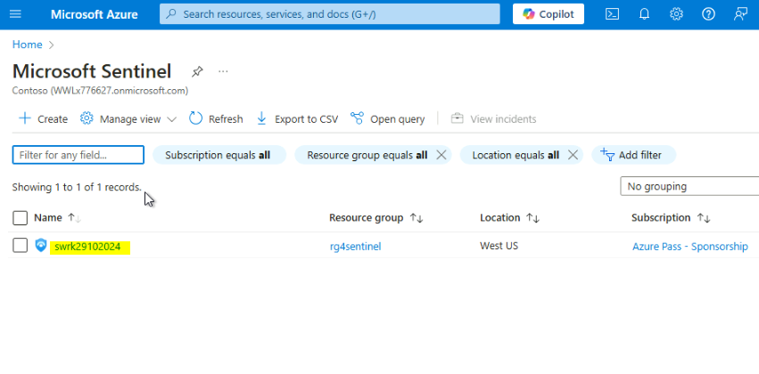

# Lab 10: Integrating Microsoft Sentinel Workspace with Microsoft Defender

## Introduction

Microsoft Sentinel's Microsoft Defender XDR incident integration allows
you to stream all Microsoft Defender XDR incidents into Microsoft
Sentinel and keep them synchronized between both portals. Incidents from
Microsoft Defender XDR include all associated alerts, entities, and
relevant information, providing you with enough context to perform
triage and preliminary investigation in Microsoft Sentinel. Once in
Sentinel, incidents will remain bi-directionally synced with Microsoft
Defender XDR, allowing you to take advantage of the benefits of both
portals in your incident investigation using Microsoft Security Copilot.

## Objectives

- Connect Microsoft Defender XDR data connectors to Sentinel for
  enhancing security capabilities

- Connect Microsoft Sentinel Workspace with Microsoft Defender for
  enhanced security monitoring

## Task 1: Connecting Microsoft Defender XDR data connectors to Sentinel 

1.  Navigate to Azure portal <https://portal.azure.co>m, search for
    Microsoft. Click on Microsoft sentinel under Service.

2.  Click on the swrkXXXXXXXX Sentinel that we have created earlier.

3.  Click on **Content management**, then select **Content hub**.

4.  In the **Microsoft Sentinel | Content hub** page search bar,
    type **Microsoft Defender XDR** and press the enter button. Scroll
    down and select **Microsoft Defender XDR**.

5.  In **Microsoft Defender XDR** pane that appears on the right side,
    navigate and click on **Install** button.

6.  After the installation is successfully completed, select
    again **Microsoft Defender XDR**, then click on
    the **Manage** button as shown in the below image.

7. In **Microsoft Defender XDR** page, navigate and select the check
    box of **Microsoft Defender XDR**, then click on **Open connector
    page** button.

8. Scroll down to **Configuration** section. Ensure to check the box
    of **Turn off all Microsoft incident creation rules for these
    products**, then click on the **Connect incidents & alerts** button.

9. On the Microsoft XDR page, scroll down and Select all the Microsoft
    Defender XDR products except

- Microsoft Defender for Cloud Apps (0/1 connected)​

- Microsoft Defender for Identity (0/3 connected)​

Click on **Apply** **changes** button.

## Task 2: Connecting Microsoft Sentinel Workspace with Microsoft Defender

1.  Open a new address bar and enter the following link to open the
    Microsoft Defender
    Portal: [**https://security.microsoft.com**](https://security.microsoft.com/)

2.  In **Get your SIEM and XDR in one place** dialog box, click
    on **Connect a workspace** button.

3.  Select **swrkXXXXXXXX** workspace and click on the **Next** button.

4.  In the **Review changes** page, click on the **Connect** button.

5.  Wait for few minutes for the workspace to be successfully connected
    to Microsoft 365 Defender. After workspace successfully connected,
    click on the **Close** button.

7. Now, in the left-sided menu bar of Microsoft Defender portal, select
    **System**, click on **Settings** and then click on **Microsoft
    Sentinel**.

8. You’ll see the status of the Sentinel workspace.

**Summary**

In this lab, you’ve learned how to integrate Microsoft Defender XDR data
connectors with Microsoft Sentinel, then you’ve connected Microsoft
Sentinel workspace with Microsoft Defender, enabling seamless
integration of SIEM and XDR solutions to centralize alerts and incidents
for enhanced security monitoring and response.
