# Lab 11: Investigating Incidents with Defender, Sentinel, and Security Copilot

## Introduction

The Microsoft Defender portal brings together a unified set of security
services to reduce your exposure to security threats, improve your
organizational security posture, detect security threats, and
investigate and respond to breaches. These services collect and produce
signals that are displayed in the portal. The two main kinds of signals
are:

**Alerts**: Signals that result from various threat detection
activities. These signals indicate the occurrence of malicious or
suspicious events in your environment.

**Incidents**: Containers that include collections of related alerts and
tell the full story of an attack. The alerts in a single incident might
come from all Microsoft security and compliance solutions, as well as
from vast numbers of external solutions collected through Microsoft
Sentinel and Microsoft Defender for Cloud.

## Objectives

- Investigate a multi-stage incident in Microsoft Defender using
  Security Copilot

- Perform in-depth incident analysis in Microsoft Sentinel with insights
  from Security Copilot

- Review and export incident details, including severity, status, and
  related alerts, for prioritization.

- Identify root causes, vulnerabilities, and remedial actions for
  critical incidents

- Adjust Security Compute Units (SCU) settings in Security Copilot to
  optimize resource usage.

**Task 1: Investigating Microsoft Defender incident in Security Copilot**

1. In **Microsoft Defender** page, navigate and click on **Incidents &
response**, then click on **Incidents & alerts**. Now, click on
**Incidents**, then click on **Multi-stage incident involving Execution
& Credential access on one point**.

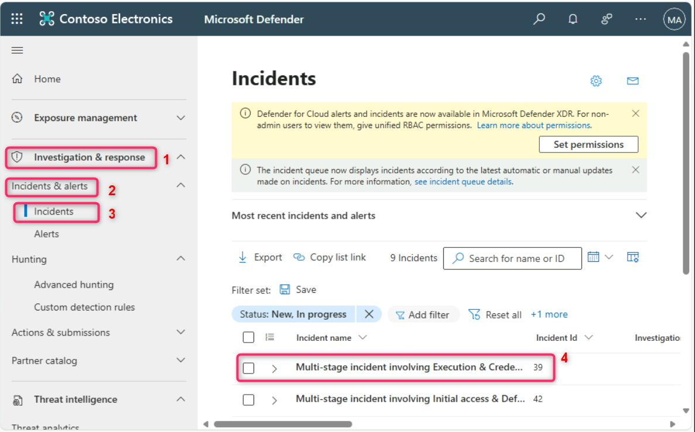

2. On **Multi-stage incident involving Execution & Credential access on
one endpoint** pane that appears on the right side, navigate and click
on **Close** button.

3. In the **Attack story** tab, navigate and click on **Copilot** on
the top right side of the page as shown in the below image.

4. Review the **Incident summary**.

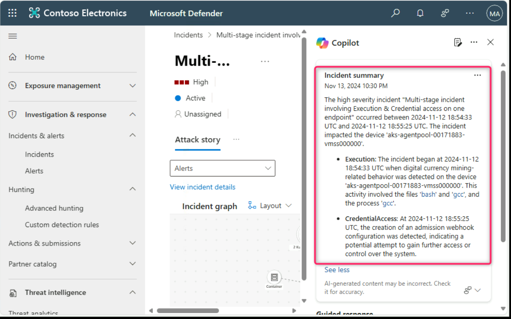

5. Click on the horizontal ellipsis beside the **Incident summary**,
then navigate and click on **Open in Security Copilot**.

6. Now, review the incident summary in the standalone portal of
Security Copilot.

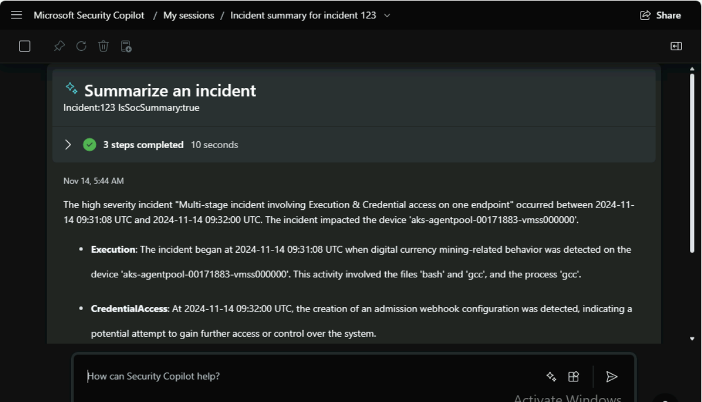

**Task 2: In-Depth Incident Analysis with Microsoft Sentinel and Security Copilot**

1. In the Security Copilot prompt bar, enter the following prompt:

+++**Provide details on the current incidents listed in Microsoft Sentinel, including incident severity, status, and associated alerts**+++

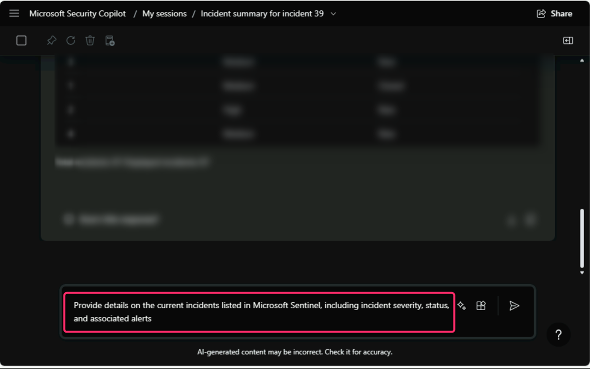

2. Carefully review the output.

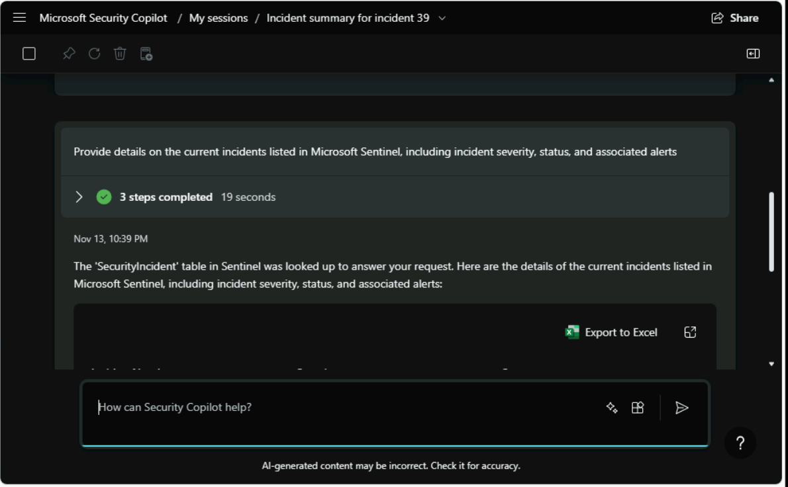

3. Now, click on **Export to Excel**, after the download is completed,
click on **Open file** link as shown in the below images.

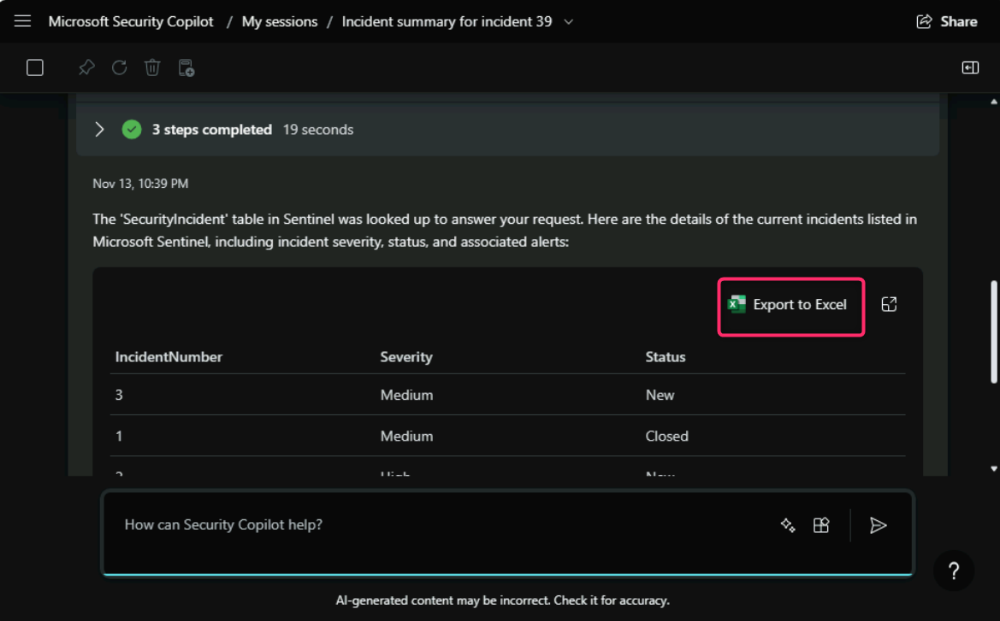

4. Carefully review the IncientNumber, Severity, and Status.

5. In the prompt bar, enter the following prompt:

+++**Which incidents in Microsoft Sentinel require immediate attention or urgent action?**+++

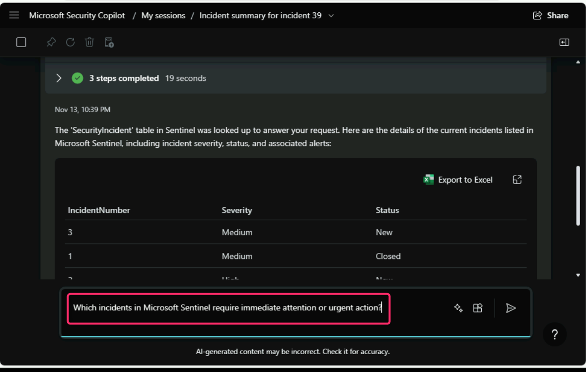

6. Note down the IncidentNumber (here, we got the **IncidentNumber
2** that requires an immediate attention). You may get a different
IncidentNumber.

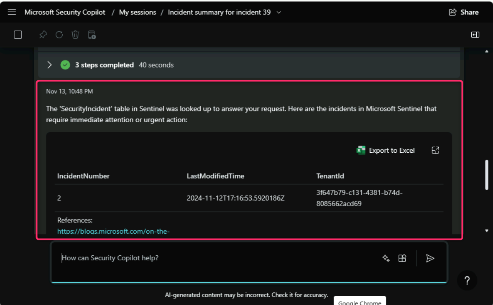

7. In the prompt bar, enter the following prompt:

**Note**: Since we received IncidentNumber 2 requiring immediate
attention, you may encounter a different IncidentNumber. Please replace
the value with the one you receive.

+++**Provide detailed information on IncidentNumber 2 in Microsoft Sentinel, including related alerts, affected assets, timeline, and recommended actions.**+++

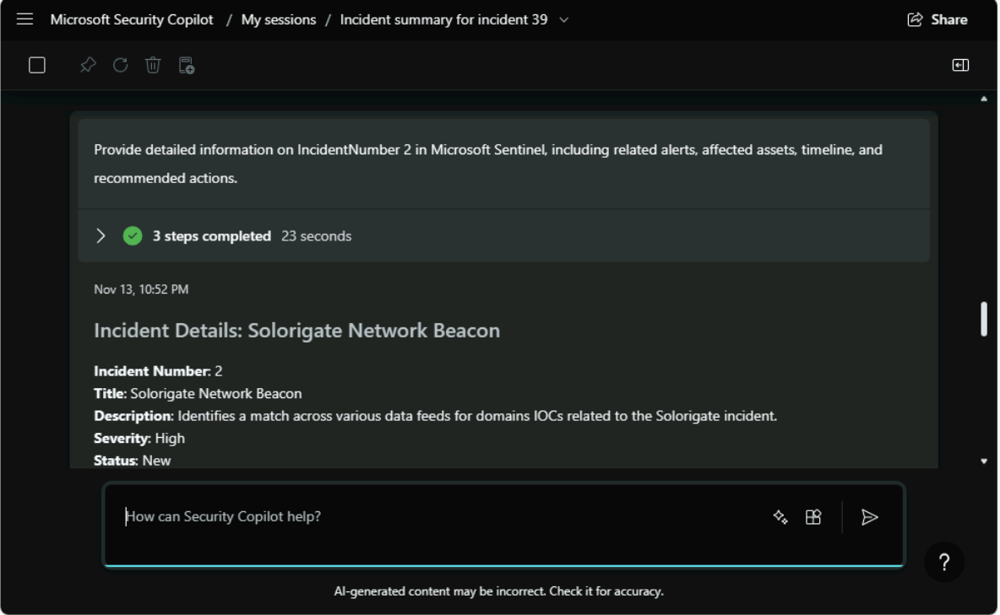

8. Carefully review the output.

9. After obtaining detailed information on the incident, the next
prompt could focus on understanding the root cause or exploring remedial
actions.

**Note**: Since we received IncidentNumber 2 requiring immediate
attention, you may get a different IncidentNumber. Please replace the
value with the one you receive.

In the Security Copilot prompt bar, enter the following prompt and
carefully review the output.

+++**Analyze the root cause of IncidentNumber 2 in Microsoft Sentinel and list any identified vulnerabilities or potential entry points.**+++

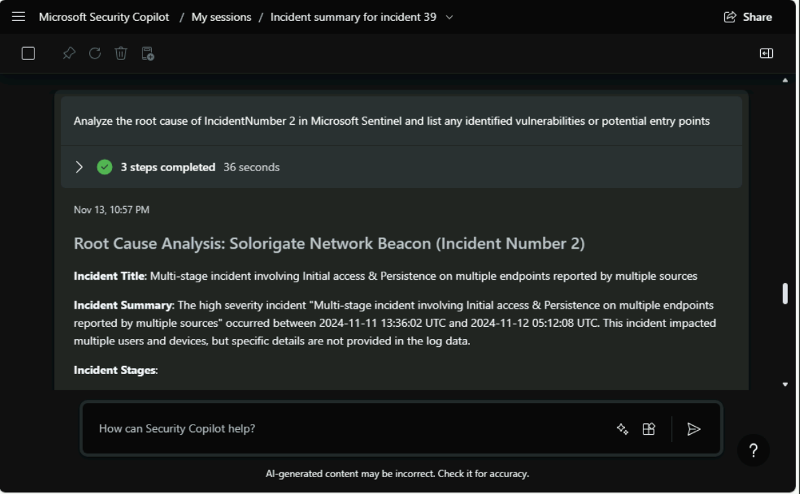

10. For further investigation, we will dive into specifics such lateral
movement related to the incident.

In the Security Copilot prompt bar, enter the following prompt and
carefully review the output.

+++**Analyze any lateral movement associated with IncidentNumber 2 in Microsoft Sentinel, detailing compromised devices or accounts and their interactions across the network**+++

> 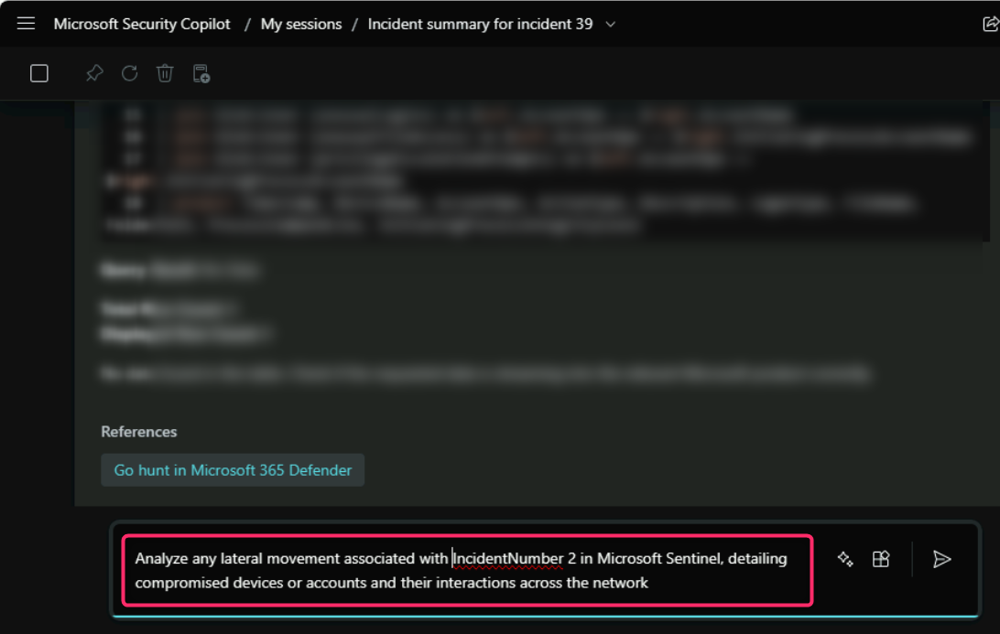
>
> 
>
> 
>
> 
>
> 

11. Enter the following prompt to explore external connections:

+++**List any external IP addresses or connections related to IncidentNumber 2 that may indicate data exfiltration or unauthorized access attempts**+++

> 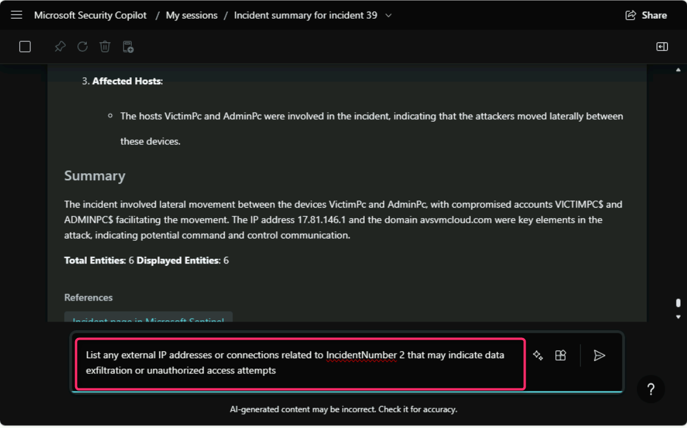

12. Review the output carefully.

> 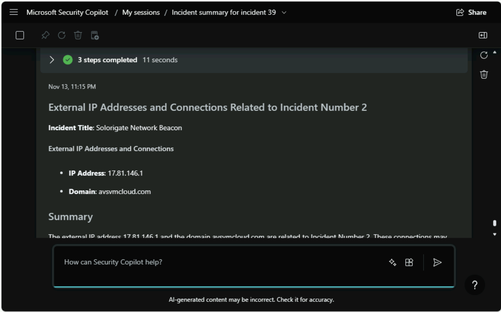
>
> 

**Task 3: Decreasing the SCU to prevent credit loss**

1.  In this task, we will decrease the SCU to prevent credit loss. In
    Security Copilot standalone portal, click on the three horizontal
    lines beside **Microsoft Security Copilot** and then click
    on **Owner settings**.

2.  Navigate to **Security compute units** and click on
    the **Change** button.

3.  Change the SCU to **1** and click on the **Apply** button.

4.  Click on the **Done** button.

**Summary**

In this lab, you’ve focused on leveraging Microsoft Defender and
Security Copilot to investigate and analyze security incidents. You’ve
reviewed a multi-stage incident involving execution and credential
access in Microsoft Defender portal using embedded Security Copilot.
Then, you’ve used Security Copilot to interact with Microsoft Sentinel,
analyzing incidents based on severity and urgency, and exporting key
details for further examination. You’ve identified the root causes,
vulnerabilities, and lateral movement while assessing external
connections for potential threats. Finally, you’ve optimized resource
consumption by adjusting Security Compute Units (SCU) in the Security
Copilot portal. This hands-on experience equipped you with practical
skills in advanced security investigation and management.
