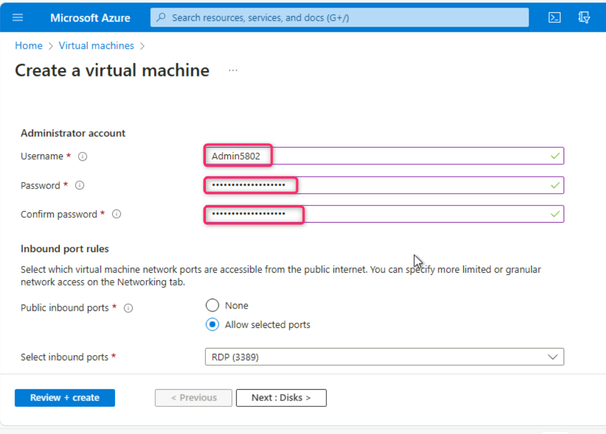

## Lab 12: Generating and Analyzing Defender for Endpoint Real-Time Alerts in Sentinel

**Introduction**

In this lab, you will explore how to investigate and respond to
real-time security alerts generated by Microsoft Defender for Endpoint
and integrated into Microsoft Sentinel. This hands-on experience will
help you understand the end-to-end process of detecting, analyzing, and
mitigating threats within an organization's IT environment.

Please note that in this lab, we used an admin tenant ID to install
Microsoft Office on **testvm1** and ran malware simulations to
demonstrate how security tools detect and respond to threats. In a
real-world scenario, users might accidentally install malware on their
systems, leading to potential security breaches. This lab aims to help
you understand how such incidents can be identified, analyzed, and
mitigated using Microsoft Defender and Sentinel in a controlled
environment.

## **Task 1: Add Owner role to subscription**

1.  In the Azure portal search box, type **subscription**, navigate and
    click on **Subscriptions** under **Services**.

2.  Click on your **Azure Pass – Sponsorship** subscription name.

3.  On **Azure Pass – Sponsorship** page, navigate and click on **Access
    control (IAM)**, click on **+Add** button, navigate and click on
    **Add role assignment as shown in the below image.**

> 

4.  On **Add role assignment** page, click on **Privileged administrator
    roles** tab, navigate and select **Owner** role, then click on the
    **Next button.**

> 

5.  Navigate and click on **+Select members** hyperlink. On **Select
    members** pane that appear on the right side, type and select your
    Office 365 tenant ID, then click on the **Select** button as shown
    in the below images.

> 
>
> 

6.  Click on the **Next** button.

> 

7.  Click again on **Review + assign** button.

> 

8.  In the **Add role assignment** – **Conditions** tab, navigate to
    **What user can do** row and select the radio button **Allow user to
    assign all roles (highly privileged)**. Then, click on **Review +
    assign** button.

> 

9.  Click again on **Review + assign** button.

> 

10. You’ll receive a notification confirming the Owner role is
    successfully assigned to the subscription.

> 

## **Task 2: Onboarding testVM1 in Microsoft Defender for Endpoints**

1\. In the Edge browser, open a new address bar and enter the following
link: `https://security.microsoft.com` to open the Microsoft Defender
Portal

2.  Close **Meet your improved security center** dialog box.

3.  In **Microsoft Defender** portal, navigate and click on **System**,
    then click on **Settings**. In the Settings page, you’ll see
    **Defender for** **Endpoints** as shown in the below image.

**Note**:

In case, you did not see **Defender for Endpoint**, ensure that you are
logged into Azure portal, then open a new address bar and enter the
following URL and wait for the configuration to be completed:

`https://security.microsoft.com/securitysettings/endpoints/integration?tid=`

This would take time; therefore, move on to the next steps.

1\. Go back to Azure portal. In the Azure portal search bar, type
**virtual machine**, then navigate and click on **Virtual machines**
under **Services**.

2\. In the Virtual machines page, navigate and click on **Create**, then
click on **Azure virtual machine**.

3\. In **Create a virtual machine**, under the **Resource group** field,
click on **Create new** link, enter the name of the resource group as
**Sentinel-RG**, and click on the **OK** button. Then, navigate to
**Instance details** section, in the **Virtual machine name** field,
enter **testvm1**. In the **Region** field, ensure **Southeast Asia**
region is selected.

5\. In the **Security type** field, click on the dropdown and select
**Standard**. Under the **Image** field, click on **See all images**
link.

6\. In **Select an image** page search field, enter **Windows 11** and
press the **Enter** button.

7\. In **Windows 11** tile, navigate and click on the dropdown beside
**Select** and select **Windows 11 Enterprise, version 23H2 -64 Gen 2**
from the list.

8\. Navigate to **Size** field and click on **See all sizes** link as
shown in the below image.

9\. In **Select a VM size** page, navigate and select **B2ms** VM size
and then click on **Select** button as shown in the below image.

11. Navigate to **Administrator account** section, enter the following
    details and leave all the field in the default state:

[TABLE]

12. Under **Licensing** section, select the checkbox **I confirm I have
    an eligible Windows 10/11 license with multi-tenant hosting
    rights**. Then, click on **Review + create** button.

13. Click on the **Create** button.

14. The virtual machine is successfully created, click on the **Go to
    resource** button.

15. You will be directed to the **testvm1** virtual machine page.

**Note**: In case, you see **testvm1 virtual machine agent status is not
ready. Troubleshoot the issue**, then wait for 10-15 and refresh the
page.

16. In **testvm1** virtual machine page, navigate and click on
    **Connect** on the left side navigation menu, scroll down to
    **Native RDP** tile, and click on the **Download RDP file**.

17. On **testvm1.rdp could harm your device. Do you want to keep it
    anyway?** dialog box, click on **Keep** button.

> 

18. On **testvm1.rdp** file, click on **Open file** link.

> 

19. On **The publisher of this remote connection can’t be identified. Do
    you want to connect anyway?** dialog box, click on **Connect**
    button.

> 

20. On **Enter your credentials** dialog box, enter the password (here,
    **Administrator5801@#** and click on the **OK** button.

21. On **The identity of the remote computer cannot be verified. Do you
    want to connect anyway?** dialog box, click on **Yes** button.

22. On the **Choose privacy settings for your device** page, click on
    **Next** couple of times and then click on **Accept** button as
    shown in the below images.

23. Go back to Microsoft Defender portal. In **Microsoft Defender**
    portal, navigate and click on **Settings**. In the **Settings**
    page, click on **Endpoints**.

**Note**: In case, you are directed to Endpoints page, then ignore this
step and move on to the next step.

24. In the **Endpoints** page, navigate to **Device management** section
    and then click on **Onboarding**.

25. Click on the dropdown under **Select operating system to start
    onboarding process** and select **Windows 10 and 11**.

26. Scroll down and click on the **Download onboarding package** button.

27. After the onboarding package is successfully downloaded, click on
    **Open file** link.

28. Copy the Windows Command script

29. Go back to **testvm1** and paste the copied Windows Command Script
    on the desktop as shown in the below image.

30. Right click on the script and select **Run as administrator**.

31. Type **Y** and press the **Enter** button to continue the onboarding
    process.

32. After onboarding the machine successfully on Defender for Endpoint,
    click on any key to continue the onboarding process.

33. The onboarding of the **testvm1** usually takes **15-30 minutes**;
    therefore, continue with the next task.

34. After 15-30 minutes, close the **testvm1**, go back to Microsoft
    Defender portal and refresh the page, navigate and click
    on **Devices**, you'll see the **testvm1** was successfully
    onboarded in Microsoft Defender for Endpoint.

## Task 3: Preparing the prerequisite on the testvm1 virtual machine

1\. In testvm1 virtual machine, open the Edge browser, then select
**Start without data** button \> **Confirm and Continue** button \>
**Continue without this data** button \> **Confirm and start browsing**
button \> **Finish** button) and enter the following URL in the address
bar: [**https://portal.office.com**](https://portal.office.com)

5.  Sign in to the Microsoft 365 portal using your O365 tenant details:

6.  In **Microsoft 365** page, navigate and click on **Install and
    more** dropdown, then click on **Install Microsoft 365 apps**.

7.  Click on **Install Office**.

8.  **OfficeSetup.exe** file will be downloaded, click on **Open file**
    link.

9.  Wait for few minutes while Microsoft 365 and Office downloads.

**Note**: The installation will take around 10-20 minutes to complete.

10. On **You’re all set!** dialog box, click on the **Close** button.

11. Click on the **Start menu** and then click on **Word** as shown in
    the below image.

12. Click on **Sign in or create account** button.

13. Login using your O365 tenant:

14. On **Stay signed in to all your apps** dialog box, click on **OK**
    button.

15. On **You’re all set** dialog box, click on **Done** button.

16. On the **Accept the license agreement** dialog box, click on
    **Accept** button.

17. On Your privacy matters dialog box, click on the **Close** button.

## **Task 4: Install git and download the payloads on testvm1**

1.  Open the Edge browser, navigate to the address bar and enter the
    following link: **https://git-scm.com/downloads**

2.  On **git** window, navigate to **Downloads** section and click on
    **Windows** as shown in the below image.

18. On **Download for Windows** page, navigate to **Standalone
    Installer** and click on **64-bit Git for Windows Setup**.

19. Click on the **Git.exe** file.

20. On **Git Setup** - **Information** dialog box, click on the **Next**
    button.

21. On **Select Destination Location** dialog box, click on the **Next**
    button.

22. On **Select Components** dialog box, click on the **Next** button.

23. On **Select Start Menu Folder** dialog box, click on the **Next**
    button.

24. On **Choosing the default editor used by Git** dialog box, click on
    the **Next** button.

25. Leave **Adjusting the name of the initial branch in new
    repositories** dialog box in default state and click on the **Next**
    button.

26. Leave **Adjusting your PATH environment** dialog box in default
    state and click on the **Next** button.

27. Leave **Choosing the SSH executable** dialog box in default state
    and click on the **Next** button.

28. Leave **Choosing HTTPS transport backend** dialog box in default
    state and click on the **Next** button.

29. Leave **Configuring the line ending conversions** dialog box in
    default state and click on the **Next** button.

30. Leave **Configuring the terminal emulator to use with Git Bash**
    dialog box in default state and click on the **Next** button.

31. Leave **Choose the default behavior of ‘git pull’** dialog box in
    default state and click on the **Next** button.

32. Leave **Choose a credential helper** dialog box in default state and
    click on the **Next** button.

33. Leave **Configuring extra options** dialog box in default state and
    click on the **Next** button.

34. Leave **Configuring experimental options** dialog box in default
    state and click on the **Next** button.

35. Wait for few minutes for the installation to complete.

36. Select **Launch Git Bash** checkbox and then click on the **Finish**
    button.

## **Task 5: Executing Malicious Documents and Scripts**

1.  In **Git Bash**, execute the following command to download
    **examples** folder containing various malware files and scripts.

**git clone https://github.com/directorcia/examples**

2.  Navigate to **C:\Users\Admin5802**, then click on **examples**
    folder as shown in the below image.

3.  You will see various malwares files and script.

4.  Right click on **RS4_WinATP-Intro-Invoice** and open the file in
    word.

5.  You will be prompted to enter the password, provide the password as
    +++**WDATP!diy#**+++ and click on the **OK** button.

6.  The file will open with a **SECURITY WARNING**, click on the
    **Enable content** button as shown in the below image.

7.  You’ll be prompted about a demo attack, click on the **OK** button.

8.  A new file **WinATP-Intro-Backdoor.exe**, which represents the
    backdoor, is created onto the Desktop by a PowerShell script
    launched from the word document.

9.  The script goes on to create a scheduled task to launch the backdoor
    at a predefined time. This mechanism of indirect process launch is
    sometimes used for stealth, as it is harder to trace back to the
    document.

**Note**: When the backdoor is launched, it creates an auto-start entry
under the registry Run key, allowing it to stay persistent by starting
automatically with Windows. A Command Prompt window opens, indicating
that the simulated backdoor is running. Close the Command Prompt window
to end the **WinATP-Intro-Backdoor.exe** process. In case, you did not
see the Command Prompt window, then move on to the next step.

10. Open
    **TestFile_Block_Office_applications_from_creating_executable** in
    word as shown in the below image.

11. Click on **Enable content**, it will execute another ransomware
    attack in **testvm1**.

In case, **Microsoft Word Security Notice** dialog box appears, click on
the **OK** button.

12. Now, open **TestFile+OfficeChildProcess** file in word.

13. Click on **Enable Content**. If you see an error, the action was
    blocked. If you see cmd.exe launch, it was not blocked.

Similarly, try to open the other word files in the examples folder.

**Running Malicious Script**

**Note**: There are some malicious script that you need to execute to
get the alerts in Microsoft Defender portal. As these scripts are
malicious, the output of the command will not be the same. Sometimes the
script execute, sometimes it will be blocked and you may encounter an
error.

14. Right click inside the folder, then navigate and click on **Open in
    Terminal**.

> 

15. Type [**ls**](urn:gd:lg:a:send-vm-keys) to get the list of the
    scripts in the folder. Then, execute the following script:

> +++[**./SQLDumper.exe**](urn:gd:lg:a:send-vm-keys)+++
>
> 

16. Run the following command:

> +++[**.\wdtestfile.exe**](urn:gd:lg:a:send-vm-keys)+++
>
> 

17. After the command successfully executed, press the **Enter** button.

> 

**Note**: Alerts generated will be started within 15-30 minutes in
Microsoft Defender Portal.

## **Task 6: Performing a ransomware attack using RanSim**

RanSim is a ransomware simulation script written in PowerShell. It
recursively encrypts files in the target directory using 256-bit AES
encryption. RanSim has no self-spreading capabilities and will only run
on the system you execute it on.

1.  Download the RanSim folder in testvm1 using the following script:

**git clone https://github.com/lawndoc/RanSim.git**

2.  Navigate to **C:\Users\Admin5802**, copy **RanSim** folder and
    placed in **C:\\**

3.  In testvm1 search bar, type +++**environment variables**+++, then
    navigate and click on **Edit environment variables for your
    account** as shown in the below image.

4.  In the **System Properties** dialog box, navigate and click on
    **Environment Variables** button.

5.  In the **Environment Variables** dialog box, click on the **New**
    button.

6.  In the next steps, you will be setting the following Parameters:

    - TargetPath : **C:\RanSim**

    - Extension : **.encrypted**

    - Key : **Q5KyUru6wn82hlY9k8xUjJOPIC9da41jgRkpt21jo2L=**

    - TargetFiles : .pdf .xls\* .ppt\* .doc\* .accd\* .rtf .txt .csv
      .jpg .jpeg .png .gif .avi .midi .mov mp3 .mp4 .mpeg .mpeg2 .mpeg3
      .mpg .ogg

7.  On the **New User Variable** dialog box, in the **Variable
    name** field, enter +++**TargetPath+++**, and in the **Variable
    value** field,
    enter +++**[C:\RanSim](urn:gd:lg:a:send-vm-keys)+++**, then press
    the **OK** button.

8.  **TargetPath** variable is successfully added. Now, click on
    the **New** button as shown in the below image.

8.  On the **New User Variable** dialog box, in the **Variable
    name** field, enter +++**[Extension](urn:gd:lg:a:send-vm-keys)+++**,
    and in the **Variable value** field,
    enter +++**[.encrypted](urn:gd:lg:a:send-vm-keys)+++**. Then, click
    on the **OK** button.

9.  **Extension** variable is successfully added. Now, click on
    the **New** button as shown in the below image.

10. On the **New User Variable** dialog box, in the **Variable
    name** field, enter +++**[Key](urn:gd:lg:a:send-vm-keys)+++**, and
    in the **Variable value** field,
    enter +++[**Q5KyUru6wn82hlY9k8xUjJOPIC9da41jgRkpt21jo2L=**](urn:gd:lg:a:send-vm-keys)+++
    Then, click on the **OK** button.

11. **Key** variable is successfully added. Now, click on
    the **New** button as shown in the below image.

12. On the **New User Variable** dialog box, in the **Variable
    name** field, enter +++**TargetFiles**+++, and in the **Variable
    value** field, enter

+++.pdf .xls\* .ppt\* .doc\* .accd\* .rtf .txt .csv .jpg .jpeg .png .gif
.avi .midi .mov mp3 .mp4 .mpeg .mpeg2 .mpeg3 .mpg .ogg+++

Then, click on the **OK** button.

13. **TargetFiles** variable is successfully added. Close
    the **Environment Variables** dialog box.

6.  Open **RanSim** folder. Click anywhere inside the folder, then right
    click and select **Open in terminal**.

**Note:** Please ensure that your RanSim folder is in C:\\

7.  In the command prompt, execute the following command to initiate a
    ransomware attack. In case, the attack failed to execute
    successfully and showed an error, then ignore and move on to the
    next step.

**.\RanSim.ps1 -Mode encrypt**

**Note**: Wait for **20-30 minutes** for the generated alerts to be
ingested in Microsoft Sentinel.

## Task 7: Use Kusto Query Language to find alert details

1.  Refresh the Microsoft Sentinel and Microsoft Defender page.

2.  In Microsoft Sentinel page, navigate to **General** section and
    click on **Logs**. **Queries** dialog box will appear, click on
    the **close** icon as shown in the below image.

**Note**: Microsoft Defender for Endpoint, formerly known as 'Microsoft
Defender ATP' (MDATP) or 'Windows Defender ATP' (WDATP).

3.  On **Microsoft Sentinel | Logs** page, run the following command to
    identify the alerts generated by Microsoft Defender for Endpoint.

[**SecurityAlert | where ProviderName contains
"MDATP"**](urn:gd:lg:a:send-vm-keys)

4.  Click on any alert and review the details.

5.  Delete the previously entered command. To see medium severity alerts
    generated by Defender for Endpoint, enter the following command:

SecurityAlert | where ProviderName == "MDATP" | where AlertSeverity ==
"Medium"

## Task 8: Analyzing the Real-Time Alerts in Microsoft Sentinel

1\. In the left-sided navigation menu, under **Threat management**,
click on **Incidents**.

2.  In the **Microsoft Sentinel | Incidents** page, select the incident,
    a right-sided pane will appear, scroll down, and click on **View
    full details** button.

3.  Under the **Overview** tab, review all the alert.

Note: As the ingestion of alerts have been going on, you might see a
different type of alert. Review the alert that are available.

4.  Click on any alert, review the alert details that appear on the
    right-sided pane. Check the **Remediation steps** if available at
    the bottom of the pane.

## Summary

In this lab, you've learned to effectively deploy, configure, and
utilize Microsoft Defender for Endpoint to investigate and respond to
real-time security alerts. Utilizing Kusto Query Language (KQL), you've
identified and analyzed real-time alerts, gained insights into threat
detection and response. You've further honed your skills by
investigating and reviewing incident details within Microsoft Sentinel,
enabling you to assess and mitigate security risks promptly.
Additionally, you've expanded your understanding of proactive security
measures by adding an Indicator of Compromise (IoC) to Threat
Intelligence. Through this lab, you've developed essential competencies
in leveraging Microsoft Defender for Endpoint for effective threat
management and incident response in dynamic cybersecurity environments.
