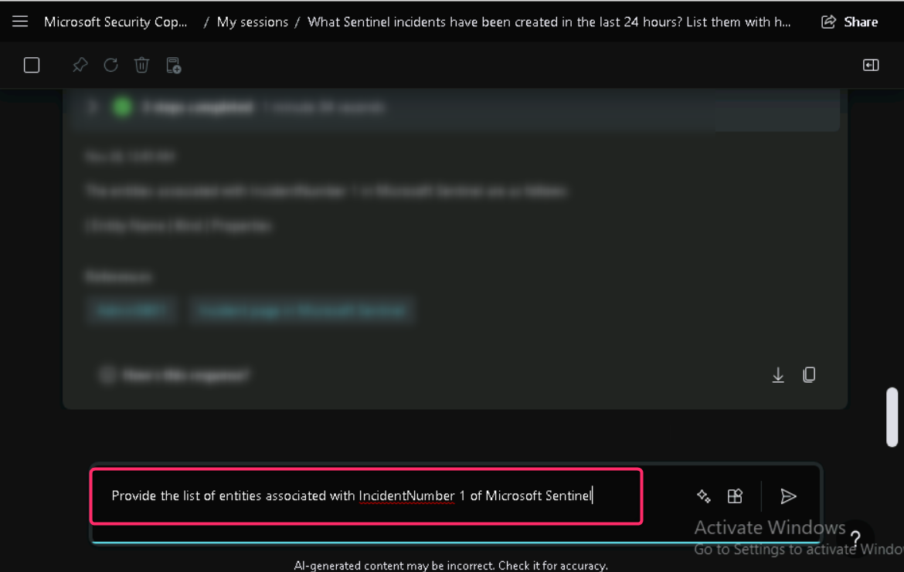

# Lab 13 - Leveraging Copilot to Uncover Threats in Microsoft Sentinel

## Introduction

Microsoft Security Copilot is a platform that helps you defend your
organization at machine speed and scale. Microsoft Sentinel's vast
security data provides an excellent source for Copilot to help analyze
incidents and generate hunting queries.

Security Copilot comes with prebuilt promptbooks, a series of prompts
that have been put together to accomplish specific security-related
tasks. They can function in a similar way as security
playbooks—ready-to-use workflows that can serve as templates to automate
repetitive steps—for instance, with regard to incident response or
investigations. Each prebuilt promptbook requires a specific input (for
example, a code snippet or a threat actor name).

## Objectives

- To increase the Security Compute Unit (SCU) capacity in Microsoft
  Security Copilot.

- Use Microsoft Sentinel with Security Copilot to investigate incidents
  and analyze entities.

- Generate executive-level summaries for non-technical audiences using
  Security Copilot prompts.

- Explore the use of promptbooks in Microsoft Security Copilot for
  advanced incident investigation

## Task 1: Increase the SCU capacity

1.  In Microsoft Security copilot window, click on the three horizontal
    lines beside **Microsoft Security copilot** and click on **Owner
    settings** as shown in the below image.

2.  Navigate to **Security compute units** and click on
    the **Change** button.

3.  Change the Security compute units to **6** and click on
    the **Apply** button.

4.  On **6 capacity units are now available to use** dialog box, click
    on the **Done** button.

## Task 2: Microsoft Sentinel with Security copilot in advanced hunting

1.  Run to following prompt to investigate the incidents in sentinel.

What Sentinel incidents have been created in the last 24 hours? List
them with highest priority incidents at the top

2.  Carefully review the output and note down the incident number. You
    may have a different **IncidentNumber**.

3.  To know more about the entities associated with incident, run the
    following prompt. The Security copilot will give you a detailed
    description along with references related to the incident (here, we
    have IncidentNumber as 1, you may have different IncidentNumber,
    therefore, keep the appropriate value of the IncidentNumber in the
    prompt)

> Provide the list of entities associated with IncidentNumber 1 of
> Microsoft Sentinel
>
> 

4.  Carefully review the output.

5.  Security copilot can summarize incidents to suit non-technical
    audiences as well, to get the summary run the following prompt.

Write an executive report summarizing this investigation. It should be
suited for a nontechnical audience.

6.  Carefully review the summary

## Task 3: Using promptbooks in Microsoft Security Copilot

1.  In **Microsoft Security Copilot** page, navigate and click on the
    horizontal lines, then click on **Promptbook library**.

2.  In the **Promptbook library** page, navigate and click on
    **Microsoft Sentinel incident investigation**.

3.  Click on **Start new session** button as shown in the below image.

4.  In **Microsoft Sentinel incident investigation** page, enter the
    **IncidentNumber** that you’ve noted in the Sentinel Incident ID
    field (here, we entered IncidentNumber 1, you may have a different
    IncidentNumber), then click on the **Submit** button.

5.  Microsoft Security Copilot generates the response.

6.  Now, carefully review the response to detect the vulnerabilities
    that are undetectable.

Summary

In this lab, you’ve enhanced your skills in utilizing Microsoft Security
Copilot to manage and investigate security incidents effectively. You’ve
used Security Copilot to interact with Microsoft Sentinel, running
prompts to investigate incidents, analyze associated entities, and
generate detailed reports tailored for different audiences.
Additionally, you explored the promptbook library, which offers a
structured approach to incident investigations, helping identify
vulnerabilities that might otherwise go unnoticed. This hands-on
experience demonstrated how to streamline security workflows and improve
incident response using Microsoft Security Copilot.
