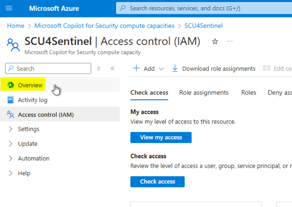

# Lab 9 – Setting up Security Copilot capacity

## Introduction

Microsoft Security Copilot (Security Copilot) is a generative AI-powered
security solution that helps increase the efficiency and capabilities of
defenders to improve security outcomes at machine speed and scale.

Security Copilot provides a natural language, assistive copilot
experience. Security Copilot helps support security professionals in
various end-to-end scenarios such as incident response, threat hunting,
intelligence gathering, posture management, and more

Copilot for Security is sold in a provisioned capacity model and is
billed by the hour. You can provision Security Compute Units (SCUs) and
increase or decrease them at any time. Billing is calculated on hourly
blocks rather than by 60-minute increments and has a minimum of one
hour. Any usage within the same hour is billed as a full SCU, regardless
of start or end times within that hour.

## Objectives

- To set up and activate Security Copilot compute capacity in the Azure
  portal

- To adjust Security Compute Units (SCUs) for optimizing performance

- To check the activation status of Microsoft Sentinel, Microsoft
  Defender XDR, and Natural Language to KQL plugins

## Task 1: Setting up Security Copilot capacity in Azure portal

1.  In the Microsoft Azure portal search bar, type **Microsoft Copilot
    for security compute capacities** and then click on it.

2.  In **Security Copilot compute capacity** window, click on **+
    Create.**

3.  On **Set up your Copilot capacity** page, in the **Resource
    group** field, click on the dropdown and select **RG4Sentinel**.
    Then, in the Capacity name field, enter the capacity name (here, we
    entered [**SCU4Sentinel**](urn:gd:lg:a:send-vm-keys)). In the Prompt
    evaluation location field, click on the dropdown and select **United
    States (US)**.

4.  In the **Security compute units per hour** field, click on the
    dropdown and select **3**. Select the checkbox of acknowledgement
    and click on **Review + create** button.

5.  Click on the **Create** button.

6.  Click on **View resource** field.

7.  Again, in the Azure portal search bar, type [**Security Copilot
    compute capacities**](urn:gd:lg:a:send-vm-keys), navigate and click
    on it.

8.  Click on the security capacity unit that you've deployed
    (here, **SCU4Sentinel**).

9.  In the **SCU4Sentinel** Security Copilot compute capacity page,
    navigate and click on **Access control (IAM)**.

10. Click on **+Add**. Then, navigate and click on **Add role
    assignment**.

11. Click on **Privileged administrator roles** tab, navigate and click
    on **Owner** role, then click on the **Next** button as shown in the
    below image.

12. Click on **+Select members**.

13. In the **Select members** pane that appear on the right side,
    navigate to **Select** field and enter your O365 tenant ID, then
    select it as shown in the below images.

14. Click on the **Next** button.

15. In the **Conditions** tab, select the **Allow user to assign all
    roles (highly privileged)** radio button and then click on
    the **Next** button.

16. Click on **Review + assign** button.

17. Click on **Overview**.

18. Scroll down and click on **Go to portal and complete setup link** as
    shown in the below image.

19. You'll be directed to **Security Copilot** page. If you see a dialog
    box -- **Are you familiar with cookies?**, then click on
    the **Accept** button.

20. Click on **Get started** button.

**Note**: In case, you are looping back to **Create a SCU capacity**
page, then refer to the steps provided in the APPENDIX at the bottom of
the lab, else continue with the next step.

21. In **Select the capacity you'd like to use** page, click on the
    dropdown and select the SCU capacity that you've created (here, we
    selected **SCU4Sentinel**), then click on the **Continue** button.

22. In **Your Customer Data will be stored in United States** page,
    click on the **Continue** button.

23. In **Help improve Copilot** page, click on the **Continue** button.

24. On the **Accessing data from Microsoft 365** services page, click
    on the **Continue** button.

25. On **Logging audit data in Microsoft Purview** page, click on the
    **Continue** button.

26. On the next page, click on the **Continue** button.

27. On **You're all set** page, click on the **Finish** button.

28. Security Copilot is successfully activated.

## Task 2: Changing SCU units

While using the prompt in Security Copilot, you will encounter a message
stating that your SCU units have been consumed and you need to increase
the SCU units. In this task, you will learn how to increase the SCU
units in Security Copilot Standalone.

**Important Note**: Microsoft recommends provisioning 3 SCUs per hour to
start your Copilot for Security exploration. However, to complete the
lab in this session with ease, we are changing the SCU units to 6.

1.  In Security Copilot window, click on the three horizontal lines
    beside **Security Copilot** and click on **Owner settings** as shown
    in the below image.

2.  Navigate to **Security compute units** and click on
    the **Change** button.

3.  Change the Security compute units to **6** and click on
    the **Apply** button.

4.  On **6 capacity units are now available to use** dialog box, click
    on the **Done** button.

## Task 3: Checking Activation Status of Microsoft Sentinel, Microsoft Defender XDR, and Natural Language to KQL Plugins

1.  In Security Copilot Standalone portal, scroll down and click
    on **Sources** icon beside the prompt bar as shown in the below
    image.

2.  Click on **Show 9 more**, then ensure that the toggle button for
    **Microsoft Defender XDR,** **Microsoft Sentinel, Natural language
    to KQL for Microsoft Defender XDR and Microsoft Sentinel
    (Preview)** are turned on as shown in the below images.

3.  Click on the close button.

**APPENDIX**

Before executing these steps, ensure to delete all the SCUs that were
previously deployed.

1. In **Security Copilot compute capacities** page, navigate and click
on **Security Copilot portal** link as shown in the below image.

2. On the **Create a security capacity** page, in **Azure
Subscription** field, select **Azure Pass – Sponsorship** from the
dropdown, in the **Resource group** field, select **MCS-RG**, in the
**Capacity name** field, enter the name of the capacity (here, we
entered !!**scu5801**!!), in the **prompt evaluation location** field,
enter **United States**, then tick the check box below it as shown in
the below image.

3. Scroll down to **Security compute units** field and select **3**
from the dropdown, tick the acknowledgement check box, then click on the
**Create** button.

4.  You will see a message that the **Capacity created** successfully.

5. Now, select the capacity from the dropdown that you have created,
then click on the **Apply** button as shown in the below image.

6.  On You’re all set dialog box, click on the **Done** button.

7.  You’ll be directed to Security Copilot main page.

8.  Go back to Azure portal – Security Copilot compute capacities page
    and refresh it, you’ll see **scu5801**.

## Summary

In this lab, you’ve created and deployed a security capacity unit (SCU),
then assigned appropriate roles for access control. You’ve learned to
modify SCU allocations to meet workload demands, ensuring seamless
exploration and usage. Finally, the lab demonstrates the process of
checking the activation status of essential integrations, including
Microsoft Sentinel, Microsoft Defender XDR, and Natural Language to KQL
plugins, ensuring all components are operational for advanced security
management.
